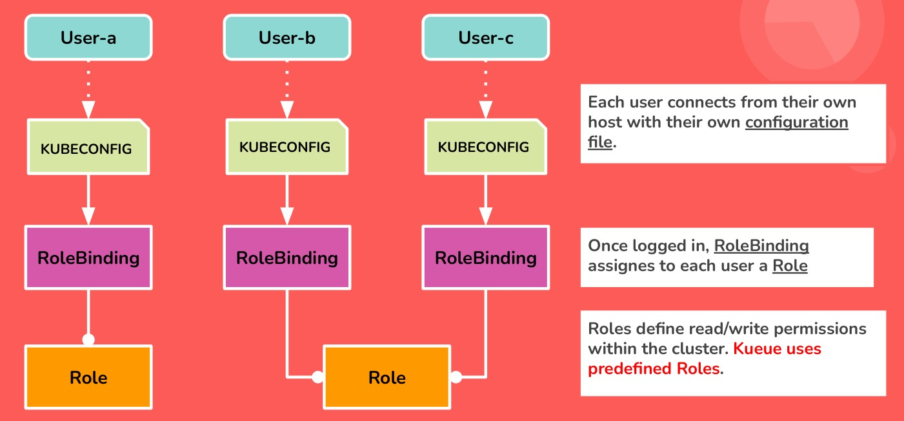

# Sviluppo di un Sistema Batch in ambito Cloud basato su Kueue

## Introduzione

L'elaborazione in batch è un sistema per eseguire elevati volumi di job sui dati di tipo ripetitivo. Il metodo in batch consente di elaborare i dati quando sono disponibili risorse di elaborazione sufficienti e con un'interazione minima o nulla da parte dell'utente. Nell’ambito di questo progetto, il batch system che è stato sviluppato ha lo scopo di eseguire dei carichi di lavoro per modelli di machine learning impiegati nel calcolo scientifico. Le risorse computazionali da gestire provengono dal Cloud e il framework su cui poggia lo sviluppo dell’applicazione è [Kubernetes](https://kubernetes.io/it/). In particolare, lo strumento utilizzato per l’amministrazione dei processi è [Kueue](https://kueue.sigs.k8s.io/), lo scheduler di job cloud-native introdotto in Kubernetes nel 2022. Esso fornisce la base di un sistema batch per l’accodamento dei processi che richiedono l’accesso ad un pool limitato di risorse.


## Analisi del Problema

Nel cluster Kubernetes che andiamo a considerare è presente almeno una CPU ed una GPU. Vi sono inoltre due tipologie di utenti batch che si conettono al sistema, le quali si differenziano per il tipo di risorsa di calcolo richiesta (CPU o GPU) e la priorità con la quale vengono ammessi in coda i loro carichi di lavoro. Ogni carico di lavoro che viene eseguito si vuole che termini quando ha concluso il suo compito oppure non ha più tempo a disposizione. 


## Progettazione dell'Algoritmo

### Scelte di Progetto

Per facilitare la gestione dell'intero sistema batch, si è scelto di raggruppare insiemi di comandi concettualmente legati all'interno di file di scripting separati. In questo modo si evita di eseguire da linea di comando tante istruzioni quanti sono gli oggetti da creare all'interno del cluster. L'automazione di questo tipo di procedure consente inoltre di rendere più veloci le fasi di testing e debugging del software.

### Passi dell'algoritmo

I passi dell'algoritmo per risolvere il problema sono i seguenti:

- Creazione del sistema di code per lo scheduling dei Job (_resources/setup-kueue-system.sh_).
- Creazione delle role per l'accesso alle due diverse tipologie di utenza al sistema (_resources/set-role.sh_).
- Creazione dei Job da ammettere nelle rispettive code (_resources/run-job.sh_).


## Alcuni dettagli implementativi

### Taint and Toleration

Kubernetes definisce diversi approcci affinché l’esecuzione dei Pod venga vincolata ad un insieme ristretto di nodi. Uno di questi fa uso delle proprità _Taint_ e _Toleration_. Taint viene definita come l'attinenza di un nodo a respingere un insieme di Pod. Dunque, per fare in modo che i Pod vengano ammessi all’interno dei nodi, vi si applicano su di essi delle tolerations. In breve: "_un Pod non può essere ammesso in un nodo se non **tollera** le **contaminazioni**_ del nodo stesso". <br>

Nel file sorgente _resources/job-team-gpu.yaml_, affinchè un carico di lavoro venga ammesso al "nodo-gpu", si è utilizzata la seguente toleration:

```
tolerations:
- key: "nvidia.com/gpu"
  operator: "Equal"
  value: "true"
  effect: "NoSchedule" 
```
dove i valori delle chiavi **operator** e **effect** seguono le rispettive descrizioni: 

- **Equal**: in `value` dovrebbe essere inserito un valore uguale a quello del taint.
- **NoSchedule**: nessun Pod senza una tolleranza corrispondente verrà pianificato sul nodo contaminato. Tuttavia i Pod attualmente in esecuzione sul nodo non vengono rimossi. <br>

Ecco di seguito com'è stato contaminato il "nodo-gpu":

```
kubectl taint nodes node-gpu key="nvidia.com/gpu":NoSchedule
```

### RBAC 

Il controllo degli accessi basato sui ruoli (RBAC) è un metodo per regolare l'accesso al computer o alle risorse di rete in base ai ruoli dei singoli utenti all'interno dell'organizzazione. L'API RBAC dichiara quattro tipi di oggetti Kubernetes: **Role**, **ClusterRole**, **RoleBinding** e **ClusterRoleBinding**. Puoi descrivere o modificare gli oggetti RBAC utilizzando strumenti come kubectl, proprio come qualsiasi altro oggetto Kubernetes. Nota: in Kueue vengono utilizzate delle Role _predefinite_. <br>

Ogni utente accede al cluster Kubernetes tramite il file di configurazione _kubeconfig_ . Una volta ammesso, l'oggetto RoleBinding (o ClusterRoleBinding) si occuperà di assegnarli la Role a lui designata, nella quale sono specificati i permessi di lettura e scrittura sulle risorse del cluster. Lo schema seguente riassume quanto descritto.



## Conclusione

Il software sviluppato funziona correttamente ed è stato testato su due differenti tipi di cluster Kubernetes: su un Cloud Provider pubblico e Docker-in-Docker. La versione di Kueue utilizzata è la `v0.6.2`. 


